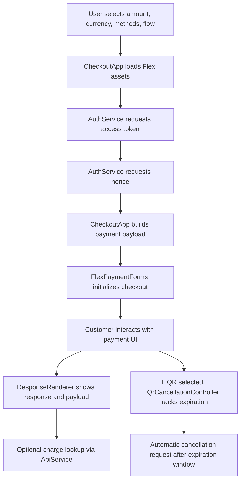

# Flex Checkout Integration Demo

Static frontend demo that showcases a production-minded payment checkout integration using Alignet Flex. The project demonstrates how to launch multiple checkout flows, request auth tokens and nonces, build payment payloads, render transaction responses, inspect charge data, and manage QR expiration/cancellation behavior from a clean UI.

In under a minute, this repo should communicate four things:

- I can build payment-focused frontend integrations, not just generic UIs.
- I understand real business constraints such as checkout reliability, operator usability, and environment switching.
- I structure code with clear responsibilities instead of putting everything in one script.
- I think about production concerns like error handling, traceability, and flow cleanup.

## Business Context

Digital payments are high-friction when teams need to validate different payment methods, environments, and merchant credentials quickly during integration or QA. A plain UI prototype is not enough. Teams need a practical sandbox where they can:

- Test multiple checkout presentation modes.
- Switch between testing and production-like environments.
- Inspect payloads and API responses.
- Reproduce QR-specific behavior such as expiration and cancellation.
- Validate that a payment flow can be restarted cleanly without leaking stale transaction state.

This project addresses that need with a lightweight but structured checkout demo.

## Problem This Project Solves

Payment integrators, QA analysts, and technical stakeholders often need a reusable frontend that helps them answer:

- What payload is being sent to the gateway?
- How does the checkout behave inline vs modal vs expanded?
- Can we test different payment methods from the same interface?
- Are QR flows observable and controllable?
- Can we inspect charge results without building a separate dashboard?

Instead of a throwaway mockup, this repo provides a focused integration workspace for payment experimentation and demo scenarios.

## Why This Matters

- Reduces friction during payment gateway onboarding.
- Makes integration behavior visible to non-backend stakeholders.
- Helps reproduce operational scenarios faster during testing.
- Demonstrates checkout orchestration, not only UI styling.

## Core Features

- Three checkout presentation modes:
  - Inline form
  - Modal popup
  - Expanded form
- Dynamic checkout configuration from the UI:
  - Amount
  - Currency
  - Payment methods
- Environment switching:
  - Testing
  - Production
- Secure credentials panel with saved profiles in `localStorage`
- Runtime token and nonce acquisition before opening checkout
- Transaction response rendering
- Sent payload inspection
- Charge lookup from the response screen
- QR expiration messaging and automatic cancellation scheduling
- Flow reset logic that clears stale runtime state and generates a fresh `merchant_operation_number` for each new request

## What This Demonstrates Technically

This repo is intentionally small, but it shows several real-world engineering signals:

- Integration-driven architecture
- External asset loading and environment-aware configuration
- Separation of concerns across auth, API access, UI orchestration, rendering, and QR lifecycle handling
- Defensive runtime cleanup between checkout attempts
- Developer-oriented observability through console diagnostics and response inspection

## Architecture

The app is split into focused classes inside [`vff_oop.js`](/Users/macbookprotouch/Documents/ALIGNET/example-flex-vff/EJEMPLO_VFF_FLEX/vff_oop.js):

- `Utils`
  - Formatting helpers, safe JSON serialization, token masking.
- `Logger`
  - Debug snapshots and DOM interaction tracing.
- `NoticeService`
  - UI notifications for QR expiration and cancellation state.
- `AuthService`
  - Requests access tokens and nonces from the configured auth endpoint.
- `ApiService`
  - Handles charge lookup and QR cancellation requests.
- `ResponseRenderer`
  - Renders the gateway response, payload sent, and API consultation block.
- `QrCancellationController`
  - Detects QR selection, calculates expiration, schedules cancellation, and updates notices.
- `CheckoutApp`
  - Main application orchestrator for environment management, asset loading, payload generation, flow opening, and state reset.

## System Flow



### Input -> Process -> Output

1. Input
   - Merchant credentials
   - Amount
   - Currency
   - Enabled payment methods
   - Selected presentation mode

2. Process
   - Load the correct Flex assets for the selected environment
   - Request token and nonce
   - Build payment payload with a unique operation number
   - Open checkout
   - Capture success, cancel, or error events
   - Optionally query the resulting charge
   - For QR, track expiration and issue cancellation

3. Output
   - Rendered checkout experience
   - Transaction response
   - Request payload visibility
   - Charge lookup result
   - QR expiration/cancellation notices

## Production-Readiness Signals

Even though this is a demo, it includes patterns that matter in real payment systems:

- Clear environment separation for `tst` and `prod`
- Explicit auth and nonce request flow
- Centralized API interaction layer
- Error handling for token, nonce, and API calls
- Observability through debug utilities and console tracing
- QR expiration tracking and cancellation workflow
- Runtime cleanup when starting a new transaction
- Unique `merchant_operation_number` generation per request to avoid stale reuse across flows

## Important Limitation

This is a frontend demo for integration and portfolio purposes. Credentials are currently handled in the browser to keep the example self-contained.

For a real production deployment, the next hardening step would be:

- Move secrets and sensitive auth flows to a backend service
- Restrict credential exposure
- Add server-side audit trails
- Add stricter access control and monitoring

## Project Structure

```txt
EJEMPLO_VFF_FLEX/
  README.md
  index.html
  vff_oop.js
  Pay-Me.png
```

- [`index.html`](/Users/macbookprotouch/Documents/ALIGNET/example-flex-vff/EJEMPLO_VFF_FLEX/index.html): UI layout, styles, and interaction entry points.
- [`vff_oop.js`](/Users/macbookprotouch/Documents/ALIGNET/example-flex-vff/EJEMPLO_VFF_FLEX/vff_oop.js): Checkout logic, services, runtime orchestration, and QR handling.
- `Pay-Me.png`: Header branding asset.

## Tech Stack

- HTML5
- CSS3
- Vanilla JavaScript
- Alignet Flex Payment Forms
- Browser `fetch` API
- `localStorage` for local credential profile persistence

## Local Setup

This project does not require Node.js, npm, or a build step.

### Option 1: Open directly

Open [`index.html`](/Users/macbookprotouch/Documents/ALIGNET/example-flex-vff/EJEMPLO_VFF_FLEX/index.html) in your browser.

### Option 2: Run a simple static server

```bash
cd /Users/macbookprotouch/Documents/ALIGNET/example-flex-vff/EJEMPLO_VFF_FLEX
python3 -m http.server 8080
```

Then open:

```txt
http://localhost:8080
```

## How to Use

1. Open the app in your browser.
2. Set the amount and currency.
3. Select the payment methods you want to expose.
4. Choose one of the three flows:
   - Inline
   - Modal
   - Expanded
5. Optionally switch environment and credentials from the secure panel.
6. Complete or simulate the checkout flow.
7. Inspect:
   - Gateway response
   - Payload sent
   - Charge lookup result

## Example Payload

The checkout payload follows this structure:

```json
{
  "action": "authorize",
  "channel": "ecommerce",
  "merchant_code": "your-merchant-code",
  "merchant_operation_number": "1742899999123000",
  "payment_method": {},
  "payment_details": {
    "amount": "100",
    "currency": "604",
    "billing": {
      "first_name": "Peter",
      "last_name": "Kukurelo",
      "email": "peter.kukurelo@pay-me.com"
    }
  }
}
```

## Developer Utilities

Helpful browser console commands:

- `window.vffDebugState()`
- `window.printQrExpiration()`
- `window.printQrCancellation()`
- `window.forceQrCancellationNow()`
- `window.abrirFormularioNormal()`
- `window.abrirModal()`
- `window.abrirFormularioExpandido()`

## Real-World Scenarios This Repo Represents

- Payment gateway onboarding demo
- Merchant integration testing workspace
- QA verification for multi-method checkout behavior
- QR payment expiration and cancellation simulation
- Frontend showcase for fintech or payments-focused portfolios

## Portfolio Value

This is not just a “demo page.” It is a compact example of how I approach integration work:

- I translate business requirements into usable technical flows.
- I separate orchestration, services, and rendering logic.
- I think about state cleanup and repeatable testing.
- I make systems easier to inspect and troubleshoot.

That combination is especially relevant for payment, fintech, and operations-heavy products.

## Next Improvements

If I were evolving this beyond demo scope, I would add:

- Backend proxy for secure credential handling
- Server-side logging and audit trail
- Automated tests for payload generation and flow reset logic
- Better API error surfacing in the UI
- Screenshot-based documentation for each checkout mode
- CI/CD deployment pipeline for a hosted demo

## Author Note

This project was built as a portfolio-ready example of a payment integration frontend that balances usability, technical clarity, and real-world operational concerns.
