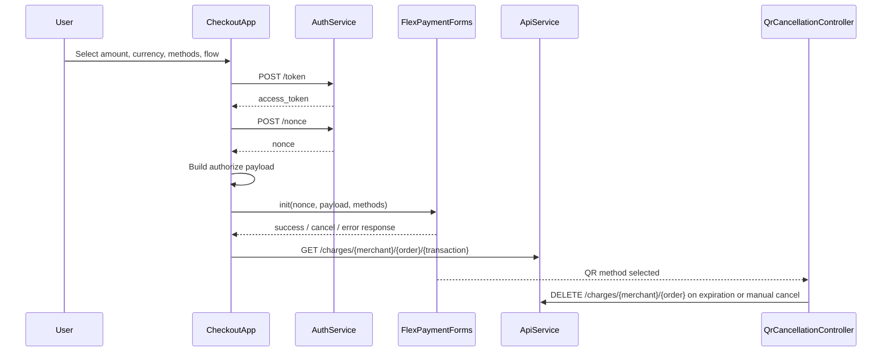

<!-- Generated from scripts/generate-readme.mjs -->

# Flex Checkout Integration Playground

Production-like payment integration demo that simulates the full checkout lifecycle across card, wallet, QR, and offline payment methods.
Designed to replicate real-world payment integration scenarios and built with a focus on debugging and transaction observability.

## Problem Statement

Real payment integrations fail for operational reasons long before they fail at UI.
Teams need a safe way to validate the entire transaction lifecycle: token creation, nonce acquisition, payload construction, checkout launch, response inspection, charge lookup, and edge cases such as QR expiration or cancellation.

In high-traffic systems, weak traceability and poor environment isolation slow down onboarding, QA, incident response, and merchant support.
This project addresses that gap with a frontend integration sandbox that behaves like a production-minded checkout orchestration layer, not just a demo screen.

## Solution Overview

This project wraps `FlexPaymentForms` with a lightweight orchestration layer that:

- Requests an `access_token` before checkout initialization
- Exchanges that token for a `nonce`
- Builds a controlled `authorize` payload for each transaction attempt
- Launches the checkout in embedded, modal, or expanded mode
- Exposes payload, transaction response, and charge lookup data for debugging
- Simulates QR expiration and cancellation flows with operational controls

It is intentionally built to simulate production-like payment flows while remaining easy to run as a static frontend demo.

## Key Features

- Token + nonce bootstrap flow before checkout initialization
- Payment orchestration across `CARD`, `YAPE`, `QR`, `PAGOEFECTIVO`, `CUOTEALO`, and `BANK_TRANSFER`
- Controlled payload construction with a fresh `merchant_operation_number` on every run
- Amount and currency handling for `PEN` and `USD`, mapped to numeric ISO values expected by the API
- Billing profile injection plus `device_origin` enrichment for better request context
- Checkout lifecycle available in 3 modes: embedded page, modal popup, and expanded layout
- Post-transaction inspection of sent payload, gateway response, and `GET /charges/{merchant_code}/{order_id}/{transaction_id}` lookup
- QR expiration monitoring with countdown, manual cancel, and optional timed auto-cancellation via `DELETE /charges/{merchant_code}/{order_id}`
- Built with a focus on debugging and transaction observability through console traces, runtime state exposure, and DOM mutation watchers
- Environment switching between `tst` and `prod`, including dynamic SDK JS/CSS loading
- Demo-friendly credential workflows with guest mode and saved profiles in `localStorage`
- Console helpers for faster diagnostics: `abrirFormularioNormal()`, `abrirModal()`, `abrirFormularioExpandido()`, `cerrarModal()`, `volverAlInicio()`, `forceQrCancellationNow()`, `setQrAutoCancellation()`, `getQrAutoCancellation()`, `printQrExpiration()`, `printQrCancellation()`, `vffDebugState()`

## Architecture

The project keeps responsibilities separated so the checkout flow remains explainable and debuggable.

| Layer | Responsibility |
| --- | --- |
| [`index.html`](./index.html) | UI shell, payment method controls, environment switching, credential panel, modal containers, and timer widgets |
| [`vff_oop.js`](./vff_oop.js) | Application orchestration, API integration, checkout lifecycle, response rendering, and QR state handling |
| `CheckoutApp` | Main orchestrator for environment config, SDK asset loading, checkout startup, controller lifecycle, and state reset |
| `AuthService` | Requests `/token` and `/nonce` before initializing the payment form |
| `ApiService` | Executes charge lookup and QR cancellation requests with versioned API headers |
| `ResponseRenderer` | Renders payload, transaction response, and charge lookup output inside the demo |
| `QrCancellationController` | Detects QR selection, computes expiration, runs countdown, and triggers automatic or manual cancellation |
| `Logger` + `NoticeService` + `Utils` | Support observability, safe serialization, UI notices, masked logging, and DOM snapshots |

### Configured Environments

| Environment | Auth Base URL | API Base URL | Cancel API Base URL |
| --- | --- | --- | --- |
| `tst` | `https://auth.preprod.alignet.io` | `https://api.dev.alignet.io` | `https://api.preprod.alignet.io` |
| `prod` | `https://auth.alignet.io` | `https://api.alignet.io` | `https://api.alignet.io` |

## Transaction Flow

1. The operator selects amount, currency, enabled payment methods, checkout mode, and optionally switches environment or credentials.
2. `CheckoutApp` loads the correct Flex SDK assets for the active environment.
3. `AuthService` requests an `access_token` using client credentials.
4. `AuthService` exchanges that token for a checkout `nonce`.
5. The app constructs a new `authorize` payload with `merchant_code`, `merchant_operation_number`, billing data, `device_origin`, amount, and currency.
6. `FlexPaymentForms` is initialized with the `nonce`, payload, display settings, and enabled methods.
7. On success, cancel, or error, the transaction response is rendered and the request payload remains visible for traceability.
8. The operator can query the resulting charge through the API from the same UI.
9. If QR is selected, the QR controller starts expiration tracking, displays a countdown, and can execute timed or manual cancellation.



## Real-World Use Cases

- Gateway onboarding demos for merchant integrations or solutions engineering
- QA sandbox for validating payload shape, method enablement, and checkout behavior before backend rollout
- Reproduction of QR expiration and cancellation scenarios during support or incident analysis
- Portfolio artifact for fintech, ecommerce, PSP, and payment orchestration roles
- Frontend reference implementation for teams planning a backend token broker or payment orchestration service

## Production Readiness Signals

- Separation of concerns between orchestration, authentication, API integration, rendering, and QR lifecycle management
- Explicit transaction traceability in both UI and console output
- Dynamic environment switching for `tst` and `prod`, including SDK asset replacement
- Idempotency-aware order reference generation through a fresh `merchant_operation_number` per attempt
- Runtime cleanup between checkout attempts to avoid stale timers, stale responses, or cross-flow contamination
- Charge lookup and cancellation paths surfaced directly for faster debugging
- Manual and automatic QR cancellation controls to model operational scenarios, not just happy paths
- Versioned API integration through the `ALG-API-VERSION` header
- Simulates production-like payment flows without hiding operational complexity

## Limitations

These constraints are intentional for a portfolio demo, but they are also the exact boundaries I would move first in a production system.

- Client credentials and merchant secrets are handled in the browser and can be stored in `localStorage`; this is not production-safe
- Token and nonce acquisition happen client-side and should be moved behind a backend integration layer
- No webhook ingestion or async reconciliation for pending, expired, cancelled, or settled states
- Observability is local to the browser; there is no persistent logging, tracing backend, or alerting pipeline
- True backend-enforced idempotency is not implemented; the demo generates a unique operation number, but not a server-side idempotency key
- Amount handling currently rounds values before sending them; a production payment system should use currency-aware precision or minor units
- The user-facing QR expiration copy says "2 minutes" while the runtime timer is configured to 1 minuto(s), which highlights a real configuration drift risk worth fixing

## Future Improvements

- Move auth, token brokerage, and secret management to a backend service
- Add correlation IDs and structured logs for better end-to-end traceability
- Introduce webhook simulation and a transaction state machine for async lifecycle handling
- Replace amount rounding with currency-aware minor-unit handling
- Add backend idempotency keys and replay protection
- Add automated tests for payload construction, environment switching, charge lookup, and QR cancellation
- Add retry, timeout, and resilience policies around API integration
- Publish a hosted demo with screenshots or GIFs for faster recruiter scanning

## Portfolio Value / Why This Matters

This is not a UI-only sample.
It shows how I think about payment orchestration, API integration, observability, checkout lifecycle control, and failure handling in systems that resemble real commerce flows.

For teams building gateways, PSPs, and high-traffic systems, the hard part is rarely rendering a form.
The hard part is making the transaction lifecycle inspectable, reproducible, and safe to operate.
That is the engineering mindset this project is designed to demonstrate.

## Run Locally

```bash
cd EJEMPLO_VFF_FLEX
python3 -m http.server 8080
```

Then open `http://localhost:8080`.
